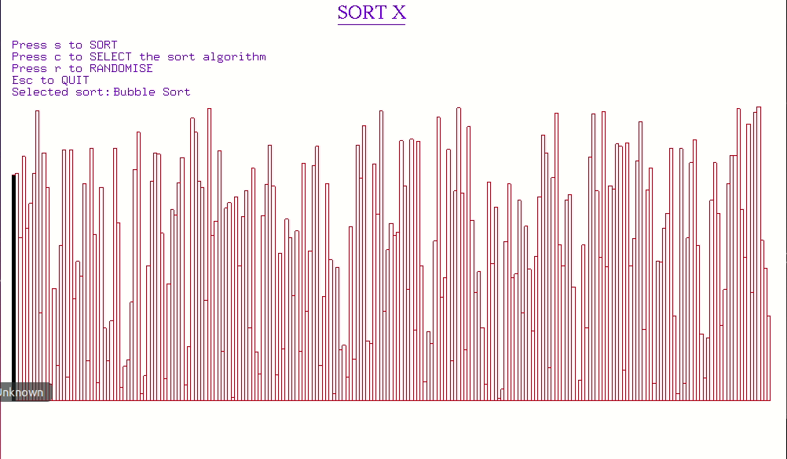

# Sorting-in-OpenGL
This repository aims to sort the numbers in ascending order in OPEN GL by creating bars.
The program contains 4 types of sorting algorithms
* Insertion Sort
* Selection Sort
* Bubble Sort
* Ripple Sort

## Running the program
Please note that all the instructions have been described for working u=in Ubuntu 18.04

Clone this repository

```git clone https://github.com/warned101/Sorting-in-OpenGL```

Install OPEN GL libraries, if not previously installed using the following commands:

```
sudo apt-get update
sudo apt-get install libglu1-mesa-dev freeglut3-dev mesa-common-dev
```

Compile it using the following command:

```g++ sortx.cpp -lGL -lGLU -lglut -Wno-write-strings```

Running the program

```./a.out```
## Example


